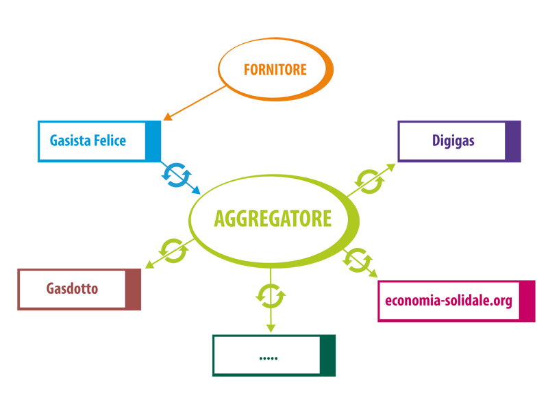
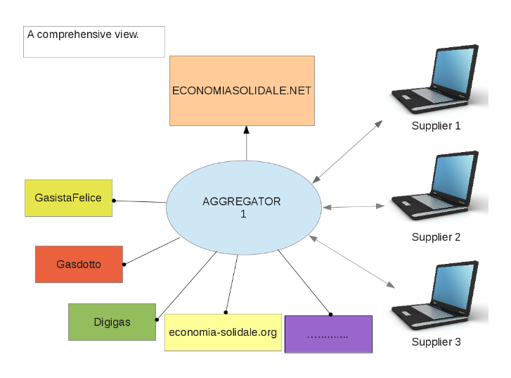

# Social Business Catalog

[Social Business Catalog (beta)](http://sbcatalog.labs.befair.it) è un aggregatore, una vetrina ed una API
per fornitori e prodotti dell'economia solidale.

### Perché

per avere un deposito (`repository`) da cui attingere e su cui riversare i dati dei fornitori e prodotti ecosol italiani;

### Come

con tecnologie "smart" che ci consentono di fare prototipazione rapida e "toccare con mano" la sfida.... e con grande entusiasmo!

SBcatalog propone:

* una interfaccia web gradevole e di semplice consultazione su PC, tablet e smartphone;
* una API che consenta ai programmatori di caricare e scaricare i cataloghi dei fornitori con cui sono in relazione;
* l'integrazione con [il portale nazionale dell'economia solidale](http://www.economiasolidale.net);

Un caso d'uso:

Visione d'insieme dove AGGREGATOR = SBCatalog:

Lo schema è stato preso dalla tesi di Matteo Micheletti "Definition and implementation of a data exchange and share standard between solidarity-based group management programmes"

**NOTA**: i nomi dei siti/software sono solo a titolo esemplificativo e non esaustivo, per una lista completa si veda il [wikibook GAS ed Economia Solidale](http://it.wikibooks.org/wiki/GAS_ed_Economia_solidale/Gruppo_d%27Acquisto_Solidale#Scegliere_un_gestionale_.28comparazione.29)

### Cosa

In particolare OGGI il contesto è costituito da questi elementi:

  * la rete **italiana** dell'economia solidale (REES ITA);
  * il formato GDXP che già sanno esportare ed importare GasDotto e Gasista Felice e in più ha passato un primo vaglio tecnico del gruppo di comunicazione della REES ITA;
  * (da condividere) una collocazione su sottodomini `*.economiasolidale.net` ad esempio: `sbcatalog.economiasolidale.net`
  * una interfaccia che raggiunga gli obiettivi PRIMARI:
    * visualizzazione e ricerca fornitori e prodotti;
    * multicanalità;
    * API import/export GDXP;
    * semplicità per l'utente;
  * una interfaccia che potrà raggiungere gli obiettivi SECONDARI:
    * ricerca per territori e categorie;
    * georeferenziazione;
    * API CRUD + import/export GDJP (corrispondente GDXP in json)
  * e infine:
    * utenti e interfaccia web di modifica delle anagrafiche e dei listini e API per la sincronizzazione con i vari software per i GAS
    * import (o possibilità di) "rating" dei fornitori e prodotti fatto su altre piattaforme

**Ora l'obiettivo è di fare un proof-of-concept per dire che "SI... PUÒ... FARE!!"**, ma anche **LO STIAMO FACENDO!**.

Sì perché l'economia solidale è questo, è inventarsi modi nuovi, è riscoprire le relazioni, è superare delle sfide
e ormai in molti lo stiamo facendo. Con leggerezza, dedizione e costanza: e ce la stiamo facendo.

Grazie a tutti quelli che ci provano

[Il team beFair](http://www.befair.it)

## Prerequisiti

È richiesto Python 3.4+, quindi Debian 8+, Ubuntu 14.04+ o Arch.

Su Debian/Ubuntu, installare Python 3, MongoDB ed NPM:

    sudo apt install python3 mongodb npm

Creare un symlink per l'eseguibile di node:

    sudo ln -s /usr/bin/nodejs /usr/bin/node

Installare Harp con NPM:

    sudo npm install -g harp

## Installazione

### Server

    $ pip install -r requirements/dev.txt
    $ cd sbcatalog
    $ cp settings_dist.py settings.py
    $ ./run.py

### Client

    $ cd frontend
    $ harp server
    $ firefox http://localhost:9000

Se il server risiede in un dominio remoto settare la `apiBaseUrl` correttamente:

    $ echo '{ "apiBaseUrl" : "http://example.org" }' > frontend/settings.json

Per esempio:

    $ echo '{ "apiBaseUrl" : "http://sbcatalog.labs.befair.it/api" }' > frontend/settings.json

### Aggiornamento Geodatabase

Per generare un elenco di fornitori georeferenziati (utilizzati dalla mappa di sbcatalog):

	$ cd sbcatalog
	$ ./run.py update-geodb

Per la `georeferenziazione` viene utilizzato [Open Street Map](http://www.openstreetmap.org/about/).

### Utilizzo API

Tramite API è possibile interagire con il database dei fornitori in questo modo:

1. Inserire nuovi fornitori con i relativi cataloghi prodotti:

    `$ curl -XPOST -d @<file.gdxp> -H "Content-type: text/xml" http://sbcatalog.labs.befair.it/api/gdxp/supplier/`

2. Scaricare tutti i fornitori e i cataloghi prodotti in formato GDXP:

    `$ curl -XGET -H "Content-type: text/xml" http://sbcatalog.labs.befair.it/api/gdxp/supplier/`

3. Scaricare tutti i fornitori e i cataloghi prodotti in formato JSON:

    `$ curl -XGET -H "Content-type: application/json" http://sbcatalog.labs.befair.it/api/supplier/`

4. Scaricare le informazioni geomatiche (coordinate, indirizzo, nome) dei fornitori:

	`$ curl -XGET -H "Content-type: application/json" http://sbcatalog.labs.befair.it/geo/supplier/`

## Test

Per lanciare i test:

    $ pip install -r requirements/dev.txt
    $ cd sbcatalog/tests
    $ py.test

## Autori

* Luca Ferroni
* Andrea Colangelo
* Antonio Esposito
* Matteo Micheletti
* Michele Sorcinelli

## License

Social Business Catalog is Copyright © 2015 beFair.it

This program is free software: you can redistribute it and/or modify it under
the terms of the GNU Affero General Public License version 3, as published by
the Free Software Foundation.

This program is distributed in the hope that it will be useful, but WITHOUT
ANY WARRANTY; without even the implied warranties of MERCHANTABILITY,
SATISFACTORY QUALITY, or FITNESS FOR A PARTICULAR PURPOSE.  See the GNU
Affero General Public License for more details.

You should have received a [copy of the GNU Affero General Public License](./LICENSE)
along with this program.  If not, see <http://www.gnu.org/licenses/>.
